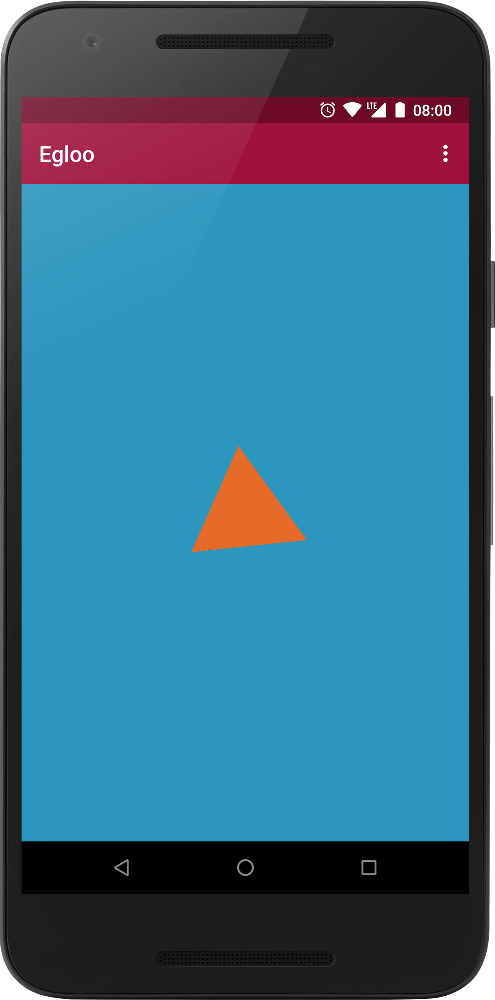
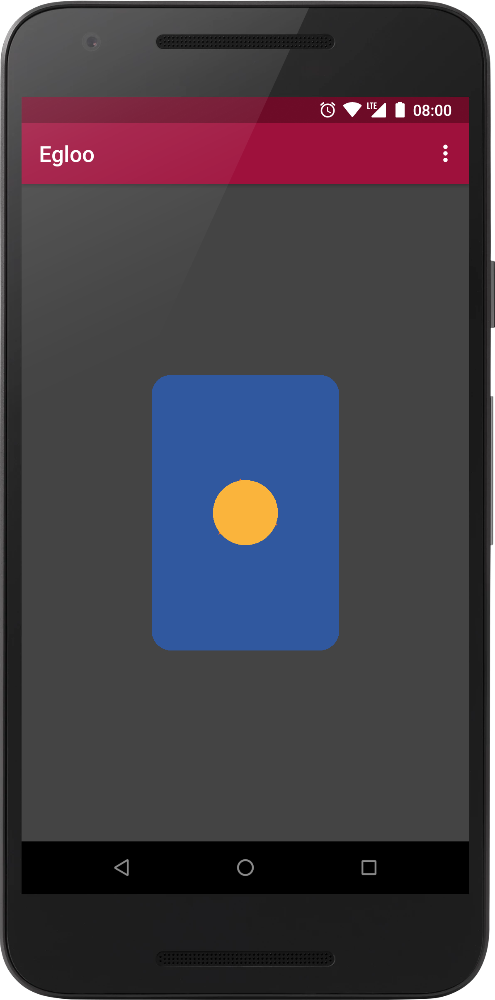
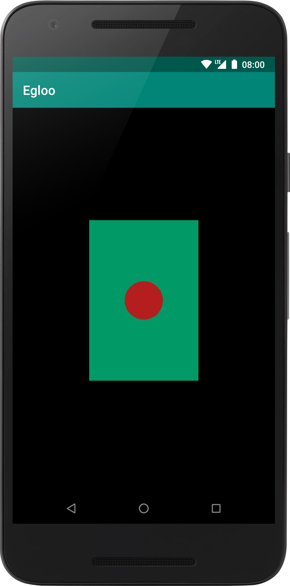

[](https://travis-ci.org/natario1/Egloo)
[](https://github.com/natario1/Egloo/releases)
[](https://github.com/natario1/Egloo/issues)

&#10240;  <!-- Hack to add whitespace -->

<p align="center">
  
</p>

*Looking for a powerful camera library? Take a look at our [CameraView](https://github.com/natario1/CameraView).*

*Transcoding videos with Egloo? Take a look at our [Transcoder](https://github.com/natario1/Transcoder).*

*Need support, consulting, or have any other business-related question? Feel free to <a href="mailto:mat.iavarone@gmail.com">get in touch</a>.*

# Egloo

Egloo (formerly EglCore) is a simple and lightweight framework for OpenGL ES drawing and EGL management
in Android that uses object-oriented components - hence the name Egl**oo**. It can serve as a basis for 
complex drawing operations, but is mostly designed for helping in making common tasks simpler,
even for people that do not have any OpenGL experience.

Approaching OpenGL from Android can be hard because of the deep differences in the OpenGL API design
with respect to a typical object-oriented context. Egloo tries to take some of these difficulties away
by creating a **thin**, flexible layer of abstraction around EGL and GLES calls.

```groovy
implementation 'com.otaliastudios.opengl:egloo:0.3.1'
```

&#10240;  <!-- Hack to add whitespace -->

<p align="center">
  
</p>

&#10240;  <!-- Hack to add whitespace -->

You can take a look at the demo app or see Egloo in action in more popular projects:

- in a zoomable Surface in the [ZoomLayout](https://github.com/natario1/ZoomLayout) library
- for transcoding videos in the [Transcoder](https://github.com/natario1/Transcoder) library

## Features

- EGL setup and management [[docs]](#egl-management)
- GLSurfaceView utilities [[docs]](#glsurfaceview-utilities)
- Drawables abstraction [[docs]](#drawables-what-to-draw)
- Programs abstraction [[docs]](#programs-how-to-draw)
- Scenes to hold view and projection matrix [[docs]](#scenes)

### Sample Usage

The function below will create a context, draw a red triangle and release:

```kotlin
// Configure an EGL context and window
val core = EglCore()
val window = EglWindowSurface(core, outputSurface)
window.makeCurrent()

// Draw
val drawable = GlTriangle() // GlDrawable: what to draw
val program = GlFlatProgram() // GlProgram: how to draw
program.setColor(Color.RED)
program.draw(drawable)

// Publish what we have drawn
// The outputSurface will receive our frame
window.swapBuffers()

// Release
program.release()
window.release()
core.release()
```

## EGL management

Creating and managing an EGL context and surface is mandatory to perform GLES drawing and
is very easy with Egloo. Classes that help in this start with the `Egl` prefix. 

### EGL context

The first thing to do is creating an EGL context. This can be done through the `EglCore` class:

```kotlin
val core = EglCore()
// At the end...
core.release()
```

The core object will configure a GLES 2 or GLES 3 compatible EGL context, based on the presence
of the `EglCore.FLAG_TRY_GLES3` class. When you are done, the core should always be released.

The core object can also accept a shared context in the constructor, so that the new EGL context
will share data with the old one.

After creation, `EglCore` can be used to create [EGL surfaces](#egl-surfaces).

### EGL surfaces

Each `EglCore` object can be used to create one or more `EglSurface`, which represent the output 
where our GLES rendered data will be drawn. Egloo supports two types of surfaces.

After usage, all surfaces should be released with `surface.release()`.

#### EglWindowSurface

The `EglWindowSurface` uses a `android.view.Surface` or `SurfaceTexture` as output, two objects that
can be considered system windows in Android. Anything drawn on this window will be passed to the
given `Surface` or `SurfaceTexture`, for display or processing.

```kotlin
// Create window and make it the current EGL surface
val window = EglWindowSurface(core, output)
window.makeCurrent()

// Draw something
// ...

// Publish drawn content into output
window.swapBuffers()
```

#### EglOffscreenSurface

The `EglOffscreenSurface` requires a `width` and a `height` in the constructor and corresponds to
an EGL pixel buffer surface which does not depend on any platform window.

```kotlin
// Create pbuffer and make it the current EGL surface
val pbuffer = EglOffscreenSurface(core, 100, 100)
pbuffer.makeCurrent()

// Draw something
// ...

// Offscreen surfaces are single buffered, so
// you don't need to swapBuffers() to publish
```

### GLSurfaceView utilities

When using the `android.opengl.GLSurfaceView` class, you can use two methods to control the EGL context
initialization. Egloo provides static implementations of these:

```kotlin
// For GLES2...
glSurfaceView.setEGLContextFactory(EglContextFactory.GLES2)
glSurfaceView.setEGLConfigChooser(EglContextFactory.GLES2)

// For GLES3...
glSurfaceView.setEGLContextFactory(EglContextFactory.GLES3)
glSurfaceView.setEGLConfigChooser(EglContextFactory.GLES3)
```

## Drawables: what to draw

In the Egloo drawing pipeline, the `GlDrawable` class controls **what to draw**.
In GLES terms, each drawable contains:
 
- its vertex array, containing the position of each vertex
- its **model matrix**, to control scale, rotation, translation, and so on
- its `glDrawArrays` logic, for example for using `GL_TRIANGLE_FAN` or `GL_TRIANGLE_STRIP`

Drawables are very easy to implement. We offer a few implementations:

|Name|Description|
|----|-----------|
|`Gl2dDrawable`|Base class for 2D drawables, that have 2 coordinates per vertex.|
|`Gl3dDrawable`|Base class for 2D drawables, that have 3 coordinates per vertex.|
|`GlRect`|A 2D drawable made of four vertices. By default, it covers the entire viewport and is typically used for textures.|
|`GlPolygon`|A regular 2D polygon. For example: `pentagon = GlPolygon(5)`.|
|`GlTriangle`|A regular 2D triangle, extending `GlPolygon`.|
|`GlSquare`|A 2D square, extending `GlPolygon`.|
|`GlCircle`|A 2D circle, implemented as a `GlPolygon` with 360 sides.|
|`GlRoundRect`|A 2D rounded rect, with customizable corners.|

Each drawable can have different methods to customize its appearance and behavior.

## Programs: how to draw

After you know what to draw through drawables, Egloo needs a `GlProgram` implementation to control
**how to draw** them. In Android terms, you can think of this as the `Paint` object that's used to
draw on canvas.

In GLES terms, a `GlProgram` is exactly an OpenGL program. It accepts a vertex shader and a fragment
shader in the constructor and manages the program itself.

A `GlProgram` can be used to draw one or more drawables using the draw method:

```kotlin
program.draw(glDrawable1)
program.draw(glDrawable2, mvpMatrix) // Optional
```

If not present, the model-view-projection matrix will be considered equal to the drawable's model
matrix. As with most other components, after usage, all programs should be released:

```kotlin
program.release()
```

Egloo offers two base program implementations.

### Flat program

The simplest program is one that draws the `GlDrawable` with a flat color. This program is called
`GlFlatProgram`:

```kotlin
val program = GlFlatProgram()
program.setColor(Color.RED)
program.draw(drawable1)
program.setColor(Color.GREEN)
program.draw(drawable2)
```

### Texture program

The `GlTextureProgram` program can be used to render texture frames. It will automatically generate
a `textureId` for you, which is meant to be used to create `SurfaceTexture`s. This means that it 
uses the `GLES11Ext.GL_TEXTURE_EXTERNAL_OES` texture target.

See the sample below:

```kotlin
val program = GlTextureProgram()
val programTexture = SurfaceTexture(program.textureId)

// Pass this surfaceTexture to Camera, for example
val camera: android.hardware.Camera = openCamera()
camera.setPreviewTexture(programTexture)

// Now the program texture receives the camera frames
// And we can render them using the program
val rect = GlRect() // Draw the full frame
programTexture.getTransformMatrix(program.textureTransform)
program.draw(rect)
```

## Scenes

When drawing different drawables, using different programs or different textures that should have
common (or separate) view and projection matrices, it can be useful to use a `GlScene`.

The `GlScene` object contains and holds:

- the view matrix
- the projection matrix

The scene can combine these with each drawable's model matrix, to create the famous model-view-projection
matrix. In GLES terms, you can think of a scene as a simple matrix holder.

When using scenes, drawing should be performed through the `GlScene` itself:

```kotlin
val scene = GlScene()

// Set common view and projection matrix in the scene object.
setProjection(scene.projectionMatrix)
setView(scene.viewMatrix)

// Draw with common parameters
scene.draw(program, drawable1)
scene.draw(program, drawable2)
scene.draw(program, drawable3)
```
 
