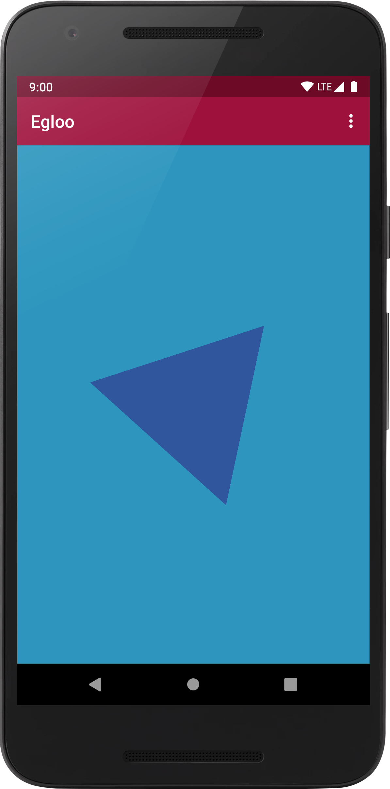
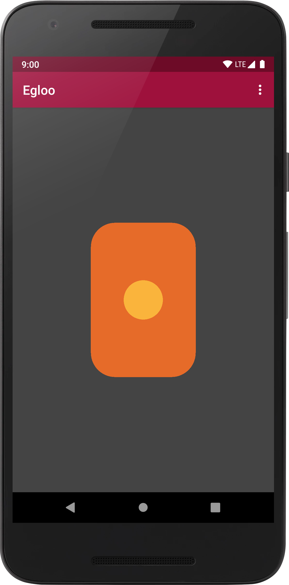
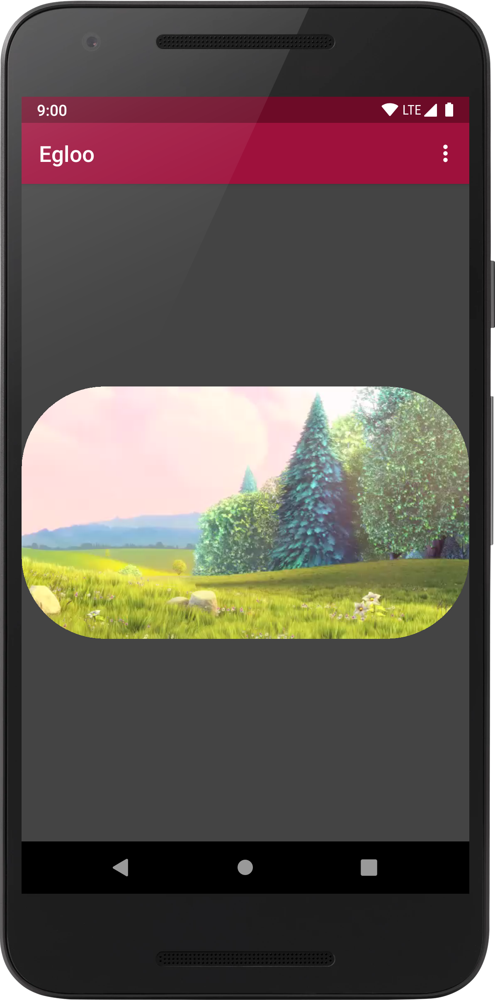

[](https://github.com/natario1/Egloo/actions)
[](https://github.com/natario1/Egloo/releases)
[](https://github.com/natario1/Egloo/issues)

&#10240;  <!-- Hack to add whitespace -->

<p align="center">
  
</p>

*Looking for a powerful camera library? Take a look at our [CameraView](https://github.com/natario1/CameraView).*

*Transcoding videos with Egloo? Take a look at our [Transcoder](https://github.com/natario1/Transcoder).*

*Need support, consulting, or have any other business-related question? Feel free to <a href="mailto:mat.iavarone@gmail.com">get in touch</a>.*

*Like the project, make profit from it, or simply want to thank back? Please consider [sponsoring me](https://github.com/sponsors/natario1)!*

# Egloo

Egloo is a simple and lightweight multiplatform framework for OpenGL ES drawing and EGL management
that uses object-oriented components - hence the name Egl**oo**. It can serve as a basis for
complex drawing operations, but is mostly designed for helping in making common tasks simpler,
even for people that do not have any OpenGL experience.

Approaching OpenGL from high-level languages can be hard because of the deep differences in the OpenGL API design
with respect to a typical object-oriented context. Egloo tries to take some of these difficulties away
by creating a **thin**, flexible layer of abstraction around EGL and GLES calls.

You can take a look at the demo app or see Egloo in action in some popular Android projects:

- for camera preview and real-time filters: see [CameraView](https://github.com/natario1/CameraView)
- in a zoomable Surface: see [ZoomLayout](https://github.com/natario1/ZoomLayout)
- for transcoding videos: see [Transcoder](https://github.com/natario1/Transcoder)

Starting from 0.5.0, Egloo can run on native targets. We provide an implementation for Android native libraries,
but other targets like iOS can probably be added easily.

```kotlin
// Regular Android projects
implementation("com.otaliastudios.opengl:egloo-android:0.5.2")

// Kotlin Multiplatform projects: add egloo-multiplatform to your common source set.
implementation("com.otaliastudios.opengl:egloo-multiplatform:0.5.2")

// Kotlin Multiplatform projects: or use the granular dependencies:
implementation("com.otaliastudios.opengl:egloo-android:0.5.2") // Android AAR
implementation("com.otaliastudios.opengl:egloo-androidnativex86:0.5.2") // Android Native KLib
implementation("com.otaliastudios.opengl:egloo-androidnativex64:0.5.2") // Android Native KLib
implementation("com.otaliastudios.opengl:egloo-androidnativearm32:0.5.2") // Android Native KLib
implementation("com.otaliastudios.opengl:egloo-androidnativearm64:0.5.2") // Android Native KLib
```

## Features

- EGL setup and management [[docs]](https://natario1.github.io/docs/egl-management)
- GLSurfaceView utilities [[docs]](https://natario1.github.io/docs/egl-management#glsurfaceview-utilities)
- Drawables abstraction [[docs]](https://natario1.github.io/docs/drawables)
- Programs abstraction [[docs]](https://natario1.github.io/docs/programs)
- Scenes to hold view and projection matrix [[docs]](https://natario1.github.io/docs/scenes)


&#10240;  <!-- Hack to add whitespace -->

<p align="center">
  
</p>


&#10240;  <!-- Hack to add whitespace -->


## Support

If you like the project, make profit from it, or simply want to thank back, please consider 
[sponsoring me](https://github.com/sponsors/natario1) through the GitHub Sponsors program! 
You can have your company logo here, get private support hours or simply help me push this forward. 

Feel free to <a href="mailto:mat.iavarone@gmail.com">contact me</a> for support, consulting or any 
other business-related question.

## Setup

Please read the [official website](https://natario1.github.io/Egloo) for setup instructions and documentation.
You might also be interested in our [changelog](https://natario1.github.io/Egloo/about/changelog). 
Using Egloo is very simple. The function below will create a context, draw a red triangle and release:

```kotlin
// Configure an EGL context and window
val core = EglCore()
val window = EglWindowSurface(core, outputSurface)
window.makeCurrent()

// Draw
val drawable = GlTriangle() // GlDrawable: what to draw
val program = GlFlatProgram() // GlProgram: how to draw
program.setColor(Color.RED)
program.draw(drawable)

// Publish what we have drawn
// The outputSurface will receive our frame
window.swapBuffers()

// Release
program.release()
window.release()
core.release()
```
 
